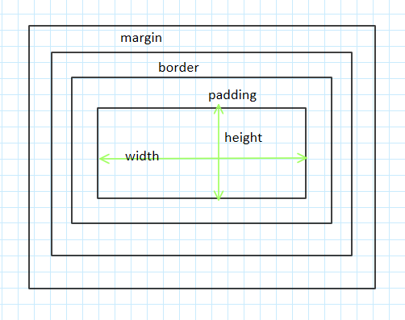

### 盒模型概述
**盒模型**是 CSS 的基石之一，它指定元素如何显示以及（在某种程度上）如何相互交互。页面上的每个元素被看做一个矩形框，这个框由元素的内容、内边距、边框和外边距组成。

注意点：
- 给元素添加背景时，背景会应用于内容和内边距组成的区域。
- 外边距时透明的，一般使用它控制元素之间的间隔。
- outline 轮廓绘制在元素框之上，所以它们不影响元素的大小或定位。
- IE 早期版本包括 IE6 将内容、内边距和边框的宽度总和设为 width。因此不要给元素添加具有指定宽度的内边距，而是尝试将内边距或外边距添加到元素的父元素或子元素。

#### 外边距叠加
当两个或更多**垂直外边距**相遇时，它们将形成一个外边距。这个外边距的高度等于两个叠加的外边距的高度中的较大者。