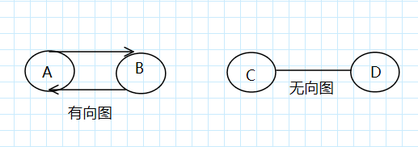

### 广度优先搜索
**广度优先搜索**是一种用于图的查找算法，可帮助回答两类问题。
- 第一类问题：从节点 A 出发，有前往节点 B 的路径吗？
- 第二类问题：从节点 B 出发，前往节点 B 的那条路径最短？

广度优先搜索的运行时间为: O(V+E),  V:定点数，E:边数

**拓扑排序**：如果任务 A 依赖于任务 B，在列表中任务 A 就必须在任务 B 后面。这种被称为拓扑排序。使用拓扑排序可以创建一个有序列表。

树是一种特殊的图，没有往后指的边。

#### 小结

- 面临类似于寻找最短路径的问题时，可尝试使用图来建立模型，再使用广度优先搜索来解决问题。
- 有向图中的边为箭头，箭头的方向指定了关系的方向。
- 无向图中的边不带箭头，其中的关系时双向的。
- 队列是先进先出（FIFO）。
- 栈是后进先出（LIFO）。
- 要按加入顺序检查搜索列表中的元素，否则找到的就不是最短路径，因此搜索列表必须是队列。
- 对于检查过的元素，务必不要在检查，否则可能导致无限循环。

