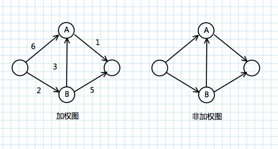

### 狄克斯特拉算法
**狄克斯特拉算法**（Dijkstra's algorithm）,也叫最短路径搜索法。是从一个顶点到其余各顶点的最短路径算法，解决的是有向图中最短路径问题。

狄克斯特拉算法找出的是总权重最小的路径。

计算非加权图中的最短路径，可以使用广度优先搜索。要计算加权图中的最短路径，可以使用狄克斯特拉算法。

狄克斯特拉算法用于每条边都有关联数字的图，这些数字称为**权重**（weight）

带权重的图称为**加权图（weighted graph）**，不带权重的图称为**非加权图（unweighted graph）**。

图还可以有环。这意味着可以从一个节点出发，走一圈又回到这个节点。

无向图意味着两个节点彼此指向对方，其实就是环！在无向图中，每条边都是一个环。狄克斯特拉算法只适用于*有向无环图*（directed acyclic graph, DAG）