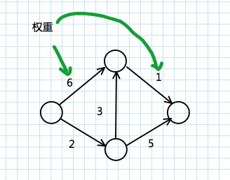

### 狄克斯特拉算法
**狄克斯特拉算法**（Dijkstra's algorithm）,也叫最短路径搜索法。是从一个顶点到其余各顶点的最短路径算法，解决的是有向图中最短路径问题。

狄克斯特拉算法找出的是总权重最小的路径。

计算非加权图中的最短路径，可以使用广度优先搜索。要计算加权图中的最短路径，可以使用狄克斯特拉算法。

狄克斯特拉算法用于每条边都有关联数字的图，这些数字称为**权重**（weight）



带权重的图称为**加权图（weighted graph）**，不带权重的图称为**非加权图（unweighted graph）**。


图还可以有环。这意味着可以从一个节点出发，走一圈又回到这个节点。


无向图意味着两个节点彼此指向对方，其实就是环！在无向图中，每条边都是一个环。狄克斯特拉算法只适用于*有向无环图*（directed acyclic graph, DAG）


狄克斯特拉算法关键理念：找出图中最便宜的节点，并确保没有到该节点更便宜的路径！

不能将狄克斯特拉算法用于包含负权边的图。

python 表示：


```python
    graph = {}
    graph["start"] = {}
    graph["start"]["a"] = 6
    graph["start"]["b"] = 2
    graph["a"] = {}
    graph["a"]["fin"] = 1
    graph["b"] = {}
    graph["b"]["a"] = 3
    graph["b"]["fin"] = 5
    graph["fin"] = {}

    # 创建开销表
    infinity = float("inf")     # 表示无穷大
    costs = {}
    costs["a"] = 6
    costs["b"] = 2
    costs["fin"] = infinity

    # 创建存储父节点的散列表
    parents = {}
    parents["a"] = "start"
    parents["b"] = "start"
    parents["fin"] = None

    # 记录处理过的节点
    processed = []

    def find_lowest_cost_node(costs):
        lowest_cost = float("inf")
        lowest_cost_node = None
        for node in costs:                  # 遍历所有节点
            cost = costs[node]
            if cost < lowest_cost and node not in processed:    # 如果当前节点的开销更低且未处理过，就将其视为开销最低的节点
                lowest_cost = cost
                lowest_cost_node = node
        return lowest_cost_node
                

    node = find_lowest_cost_node(costs)     # 在未处理的节点中找出开销最小的节点
    while node is not None:                 # while 循环在所有节点都被处理过后结束
        cost = costs[node]
        neighbors = graph[node]
        for n in neighbors.keys():          # 遍历当前节点的所有邻居
            new_cost = cost + neighbors[n]
            if costs[n] > new_cost:         # 如果经当前节点前往该邻居更近，就更新该邻居的开销
                costs[n] = new_cost
                parents[n] = node           # 同时将该邻居的父节点设置为当前节点
        processed.append(node)              # 将节点标记为处理过
        node = find_lowest_cost_node(costs) # 找出接下来的节点，并循环

    print("cost is ",costs['fin'])
```
