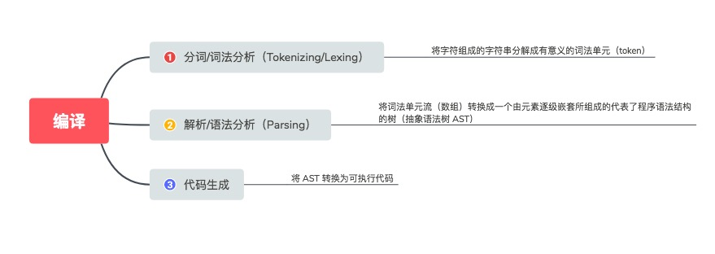
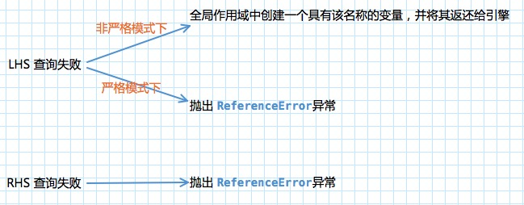

### 编译原理
 

任何 JavaScript 代码片段在执行前都要进行编译（通常就在执行前）。

### 理解作用域
作用域是根据名称查找变量的一套规则，用于确定在何处以及如何查找变量（标识符）。如果查找的目的是对变量进行赋值，那么就会使用 LHS 查询；如果目的是获取变量的值，就会使用 RHS 查询。
|	查询类型			|		  含义  |	  理解方法 	|示例|
|  :------:  |  :------:  |  :------:  |	:------:	|
|  LHS  |  赋值操作的左侧  |  赋值操作的目标是谁(LHS)  |	```a = 2```, 这里对 ```a``` 的引用是 LHS 引用，并不关心当前的值是什么，只是想要为 ```= 2``` 这个赋值操作找到一个目标	|
|  RHS  |  赋值操作的右侧  |  谁是赋值操作的源头(RHS)  |	```console.log(a)```, 	这里对 ```a``` 的引用是一个 RHS 引用，因为 ```a``` 并没有赋予任何值。相应地，需要查找并取得 ```a```  的值，这样才能将值传递给 ```console.log(...)``` 。|

#### 作用域嵌套
当一个块或函数嵌套在另一个块或函数中时，就发生了 **作用域的嵌套** 。因此，在当前作用域中无法找到某个变量时，引擎就会在外层嵌套的作用域中继续查找，直到找到该变量，或抵达最外层的作用域（也就是全局作用域）为止。

遍历嵌套作用域链的规则： 引擎从当前的执行作用域开始查找变量，如果找不到，就会向上一级继续查找。当抵达最外层的全局作用域时，无论找到还是没找到，查找过程都会停止。

### 异常
查询失败是指在所有嵌套的作用域中遍寻不到所需的变量。
 

**TypeError**： 试图对一个非函数类型的值进行函数调用，或者引用 `null` 或 `undefined` 类型的值中的属性，那么引擎会抛出另一中类型的异常，叫做 `TypeError`。

**ReferenceError** 同作用域判别失败相关，而 TypeError 则代表作用域判别成功了，但是对结果的操作是非法或不合理的。