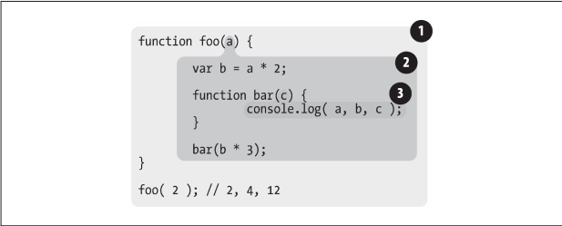

作用域共有两种主要的工作模式：
-  词法作用域
-  动态作用域
#### 2.1 词法阶段
**词法作用域**：就是定义在词法阶段的作用域。词法作用域是由你在写代码时将变量和块作用域写在哪里来决定的，因此词法分析器处理代码时会保持作用域不变（大部分情况下是这样的）。


1、包含着整个全局作用域，其中只有一个标识符：foo。
2、包含着 foo 所创建的作用域，其中有三个标识符：a、bar 和 b。
3、包含着 bar 所创建的作用域，其中只有一个标识符：c。

#### 查找
作用域气泡的结构和互相之间的位置关系给引擎提供了足够的位置信息，引擎用这些信息来查找标识符的位置。

**作用域查找会在找到第一个匹配的标识符时停止。** 在多层的嵌套作用域中可以定义同名的标识符，这叫做“```遮蔽效应```”（内部标识符“遮蔽”了外部的标识符）。抛开遮蔽效应，作用域查找始终从运行时所处的最内部作用域开始，逐级向外或者说向上进行，知道遇到第一个匹配的标识符为止。

无论函数在哪里被调用，也无论它如何被调用，它的词法作用域都只由函数被声明时所处的位置决定。

#### 2.2 欺骗词法
**欺骗词法作用域会导致性能下降**

#### 2.2.1 eval
JavaScript 中的 eval(...) 函数可以接受一个字符串为参数，并将其中的内容视为好像在书写时就存在于程序中这个位置的代码。
```javascript
function foo(str, a) {
	eval(str);  // 欺骗！
	console.log(a, b);
}

var b = 2;

foo( "var b = 3;", 1 );  // 1, 3
```
这段代码实际上在 foo(...) 内部创建了一个变量 b ，并遮蔽了外部（全局）作用域中的同名变量。

默认情况下，如果 eval(...) 中所执行的代码包含一个或多个声明（无论是变量还是函数），就会对 eval(...) 所处的词法作用域进行修改。

#### 2.2.2 with
with 通常被当作重复引用同一个对象中的多个属性的快捷方式，可以不需要重复引用对象本身。
```javascript
var obj = {
	a: 1,
	b: 2,
	c: 3
};

// 单调乏味的重复 "obj"
obj.a = 2;
obj.b = 3;
obj.c = 4;

// 简单的快捷方式
with (obj) {
	a = 3;
	b = 4;
	c = 5;
}
```

#### 2.2.3 性能
Javascript 引擎会在编译阶段进行数项的性能优化。其中有些优化依赖于能够根据代码的词法进行静态分析，并预先确定所有变量和函数的定义位置，才能在执行过程中快速找到标识符。但如果引擎在代码中发现了 eval(...) 或 with，它只能简单地假设关于标识符位置的判断都是无效的，因为无法在词法分析阶段明确知道 eval(...) 会接收到什么代码，这些代码会如何对作用域进行修改，也无法知道传递给 with 用来创建新词法作用域的对象的内容到底是什么。

#### 2.3 小结
词法作用域意味着作用域是由书写代码时函数声明的位置来决定的。编译的词法分析阶段基本能够知道全部标识符在哪里以及是如何声明的，从而能够预测在执行过程之中如何对它们进行查找。

JavaScript 中有两个机制可以“欺骗”词法作用域：eval(...) 和 with。前者可以对一段包含一个或多个声明的“代码”字符串进行演算，并借此来修改已经存在的词法作用域（在运行时）。后者本质上是通过将一个对象的引用当作作用域来处理，将对象的属性当作作用域的标识符来处理，从而创建了一个新的词法作用域（同样是运行时）。

这两个机制的副作用是引擎无法在编译时对作用域查找进行优化，因为引擎只能谨慎地认为这样的优化是无效的。使用这其中任何一个机制都导致代码运行变慢。