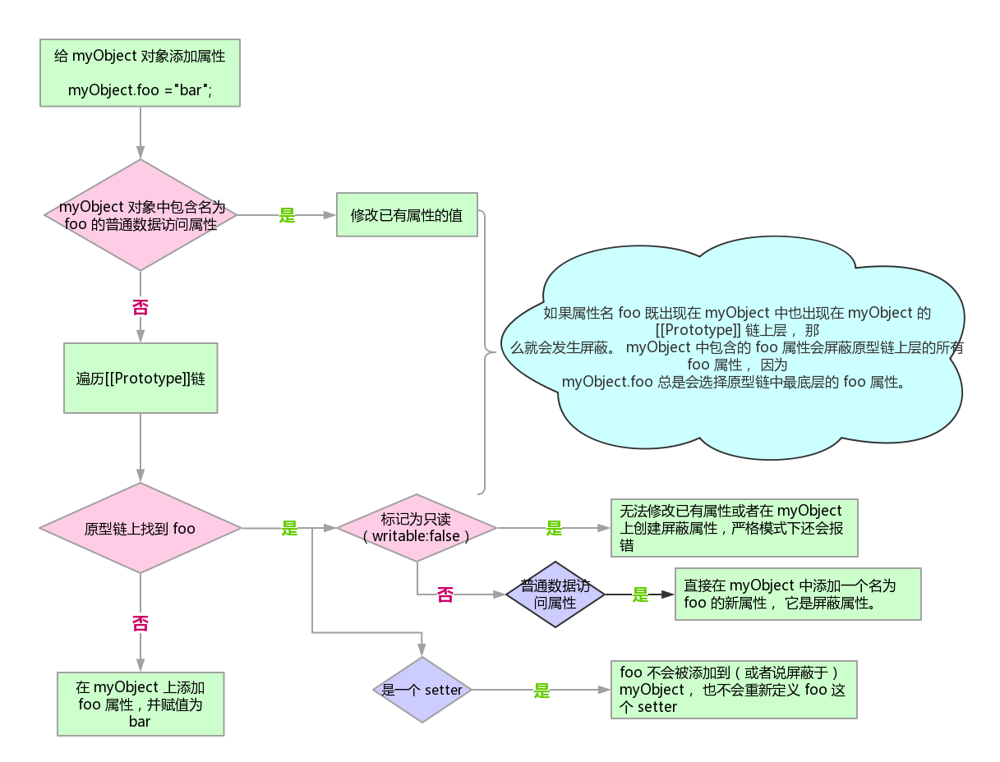

### 5.1 [[Prototype]]
JavaScript 中的对象有一个特殊的 [[Prototype]] 内置属性，其实就是对于其他对象的引用。

对于默认的 [[Get]] 操作来说， 如果无法在对象本身找到需要的属性， 就会继续访问对象
的 [[Prototype]] 链:
```javascript
  var anotherObj = {
    a: 2
  };

  // 创建一个关联到 anotherObj 的对象
  var myObject = Object.create( anotherObj );

  myObject.a; // 2
```
现在 myObject 对象的 [[Prototype]] 关联到了 anotherObj。显然 myObject.a 并不存在，但是尽管如此，属性访问仍然成功地（在 anotherObj 中）找到了值 2。

但是，如果 anotherObj 中也找不到 a 并且 [[Prototype]] 链不为空的话，就会继续查找下去。

这个过程会持续找到匹配属性名或者查找完整条 [[Prototype]] 链。如果是后者的话，[[Get]] 操作的返回值是 undefined。

使用 for..in 遍历对象时原理和查找 [[Prototype]] 链类似，任何可以通过原型链访问到的（并且是 enumerable）的属性都会被枚举。

使用 in 操作符来检查属性在对象中是否存在时，同样会查找对象的整条原型链（无论属性是否可枚举）。

#### 5.1.1 Object.prototype
所有普通的 [[Prototype]] 链最终都会指向内置的 Object.prototype。

#### 5.1.2 属性设置和屏蔽


### 5.2 “类”
#### 5.2.2 “构造函数”
在 JavaScript 中对于“构造函数” 最准确的解释是， 所有带 new 的函数调用。
函数不是构造函数， 但是当且仅当使用 new 时， 函数调用会变成“构造函数调用”。
